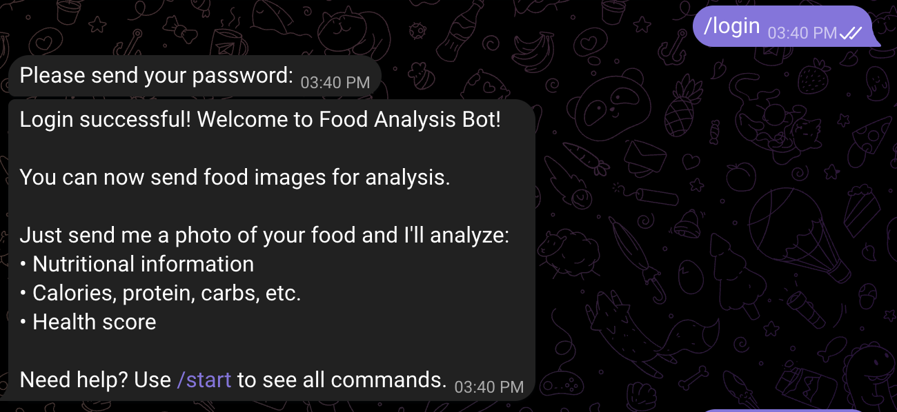
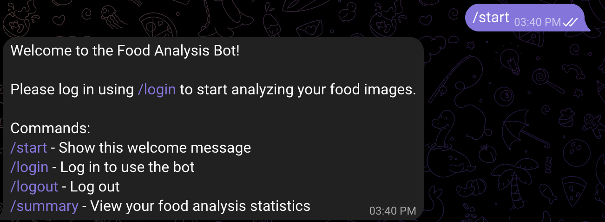
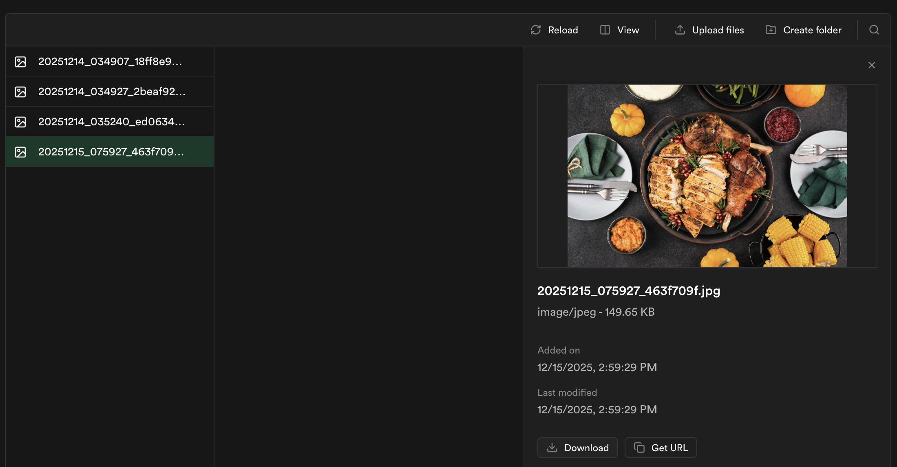
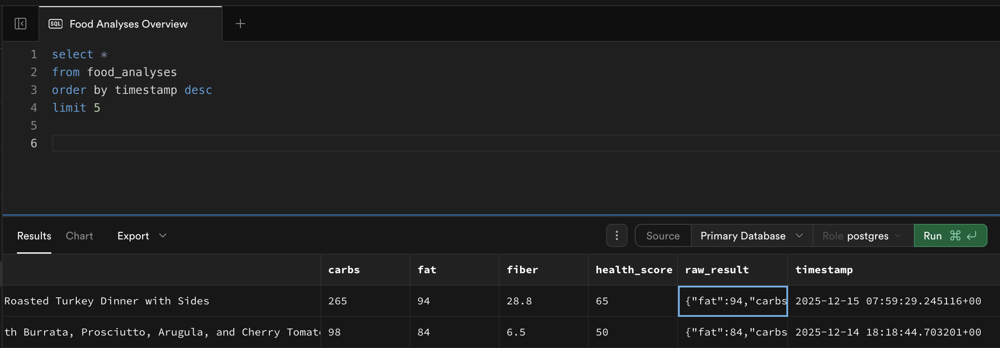
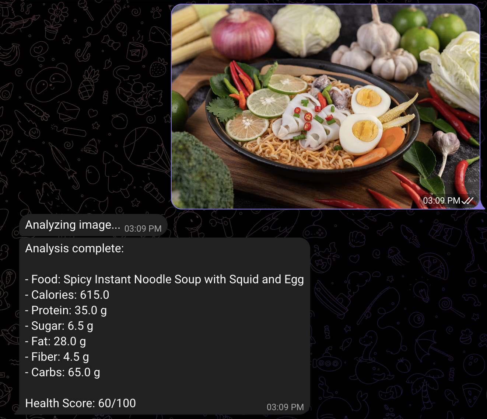
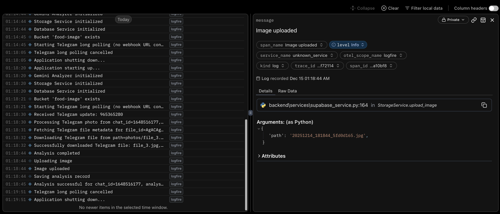

# Food Image Analysis API

FastAPI service that analyzes food images with Google Gemini and returns structured nutrition facts. Images are validated, analyzed, stored in Supabase Storage, and results are persisted in Supabase Postgres.

## Features

- AI-powered analysis via Gemini (structured output)
- Upload via multipart, base64 JSON, or Telegram file_id
- Supabase Storage for images + Supabase Postgres for results/history
- FastAPI docs (`/docs`, `/redoc`) and health check
- Logfire instrumentation for observability

## Tech Stack

- FastAPI, Pydantic v2, Pillow
- Google Generative AI (Gemini)
- Supabase (Postgres + Storage)
- Logfire
- Uvicorn

## Project Structure

```
food_image_analysis/
├─ main.py                      # FastAPI entrypoint (lifespan + routes)
├─ backend/
│  ├─ config.py                 # Pydantic Settings (env-validated config)
│  ├─ models/
│  │  └─ models.py              # Pydantic models & schemas
│  └─ services/
│     ├─ image_utils.py         # Image validation/normalization helpers
│     ├─ gemini_analyzer.py     # Gemini AI integration
│     └─ supabase_service.py    # Supabase DB & Storage services
├─ frontend/                    # (optional frontend)
├─ images/                      # Sample images
├─ requirements.txt             # Python dependencies
├─ .env.example                 # Environment variables template
├─ README.md
└─ WORKFLOW.md                  # Detailed workflow guide
```

## Installation

### Prerequisites

- Python 3.9+
- Supabase account (service role key)
- Google AI API key (Gemini)
- Logfire token (optional)
- Telegram bot token (optional, for Telegram uploads)

### Setup

1. Clone the repository:
```bash
git clone <repository-url>
cd food_image_analysis
```

2. Install dependencies:
```bash
pip install -r requirements.txt
```

3. Create a `.env` from the example and fill required values:
```bash
cp .env.example .env
```

Key env vars (see `backend/config.py` for full list):
```env
SUPABASE_PROJECT_URL=...
SUPABASE_SERVICE_KEY=...
SUPABASE_BUCKETS=food-images
SUPABASE_TABLE=food_analyses
GOOGLE_API_KEY=...
LOGFIRE_WRITE_TOKEN=optional-logfire-token
TELEGRAM_BOT_TOKEN=optional-telegram-token
# Optional overrides
ALLOWED_ORIGINS=["http://localhost:3000"]
MAX_IMAGE_SIZE_MB=10
```

4. Set up Supabase database table (SQL):

```sql
CREATE TABLE IF NOT EXISTS food_analyses (
    id UUID PRIMARY KEY DEFAULT gen_random_uuid(),
    image_path TEXT NOT NULL,
    food_name TEXT NOT NULL,
    calories FLOAT NOT NULL,
    sugar FLOAT NOT NULL,
    protein FLOAT NOT NULL,
    carbs FLOAT NOT NULL,
    fat FLOAT NOT NULL,
    fiber FLOAT NOT NULL,
    health_score INT,
    others TEXT NOT NULL,
    raw_result JSONB,
    timestamp TIMESTAMP WITH TIME ZONE DEFAULT NOW(),
    created_at TIMESTAMP WITH TIME ZONE DEFAULT NOW()
);
CREATE INDEX IF NOT EXISTS idx_created_at ON food_analyses(created_at DESC);
ALTER TABLE food_analyses ENABLE ROW LEVEL SECURITY;
CREATE POLICY "Allow all operations" ON food_analyses FOR ALL USING (true) WITH CHECK (true);
```

## Usage

### Running the Server

```bash
uvicorn main:app --reload --host 0.0.0.0 --port 8000
```

```bash
python main.py
```

API: `http://localhost:8000`

### API Endpoints

#### System
- **GET** `/health`
- **GET** `/docs`
- **GET** `/redoc`

#### Analysis
- **POST** `/analyze` — multipart upload
- **POST** `/analyze-base64` — JSON with base64 image
- **POST** `/analyze-telegram` — supply `file_id` from Telegram

#### History
- **GET** `/analysis/{analysis_id}`
- **GET** `/history?limit=10&offset=0`
- **DELETE** `/analysis/{analysis_id}`

#### Statistics
- **GET** `/statistics`

### Example Usage

Upload (multipart):
```bash
curl -X POST "http://localhost:8000/analyze" \
  -F "file=@path/to/food_image.jpg"
```

Upload (base64 JSON):
```python
import base64, requests
with open("food_image.jpg", "rb") as f:
    image_data = base64.b64encode(f.read()).decode()
resp = requests.post(
    "http://localhost:8000/analyze-base64",
    json={"image_data": image_data, "filename": "food_image.jpg"},
)
print(resp.json())
```

Telegram (file_id):
```bash
curl -X POST "http://localhost:8000/analyze-telegram?file_id=<telegram_file_id>"
```

Telegram bot delivery:
- If you provide `TELEGRAM_WEBHOOK_URL`, the server registers the webhook on startup.
- If no webhook URL is set, the app now falls back to long-polling automatically — just run `python main.py` and send the bot a photo.
- Optional: set `ENABLE_NGROK=true` (and ensure `ngrok` is on PATH). On startup the app will open a tunnel on `NGROK_PORT` (default 8000), auto-set `TELEGRAM_WEBHOOK_URL`, and register the webhook for you.

History:
```bash
curl "http://localhost:8000/history?limit=5"
```

### Response Format

```json
{
  "analysis_id": "123e4567-e89b-12d3-a456-426614174000",
  "nutrition": {
    "food_name":"pizza",
    "calories": 320.0,
    "sugar": 8.5,
    "protein": 28.0,
    "carbs": 12.0,
    "fat": 10.0,
    "fiber": 12.0,
    "others": "This food contains...",
    "health_score":80,
    ...
  },
  "image_url": "https://xxx.supabase.co/storage/v1/object/public/food-images/...",
  "timestamp": "2025-10-15T00:00:00Z"
}
```

## How It Works (pipeline)
1. Login with a credential in `.env` 
2. Users can select various commands such as `/summary`, `/logout` 

3. Upload a single food image on the Telegram chatbot
4. Validate image (size/format) and normalize (RGBA→RGB, re-encode, data URI).
5. Send to Gemini for structured `NutritionAnalysis`.
6. Upload processed image to Supabase Storage (public URL).

7. Persist results + image URL in Supabase Postgres.

8. Return `FoodAnalysisResponse` (analysis_id, nutrition, image_url, timestamp).

9. Logfire check:

10. Users choose to logout 

## Key Components

- `backend/config.py`: Typed Settings loader (env validation), CORS origins, max image size.
- `backend/services/image_utils.py`: Shared image validation/normalization + data URI prep.
- `backend/services/gemini_analyzer.py`: Gemini integration for structured nutrition output.
- `backend/services/supabase_service.py`: Supabase DB/Storage with async-safe thread wrapping.

## Configuration

### Environment Variables

| Variable | Description | Required |
|----------|-------------|----------|
| `SUPABASE_PROJECT_URL` | Supabase project URL | Yes |
| `SUPABASE_SERVICE_KEY` | Supabase service role key | Yes |
| `SUPABASE_BUCKETS` | Storage bucket name | Yes |
| `SUPABASE_TABLE` | Database table name | Yes |
| `GOOGLE_API_KEY` | Google AI API key for Gemini | Yes |
| `LOGFIRE_WRITE_TOKEN` | Logfire token (optional) | No |
| `TELEGRAM_BOT_TOKEN` | Telegram bot token (for `/analyze-telegram`) | No |
| `TELEGRAM_WEBHOOK_URL` | Public HTTPS URL to set webhook automatically (optional) | No |
| `ALLOWED_ORIGINS` | CORS allowlist (JSON array) | No |
| `MAX_IMAGE_SIZE_MB` | Max upload size in MB | No |

### Supported Image Formats

- JPEG / JPG, PNG, WEBP, GIF
- Default max size: 10 MB (override via `MAX_IMAGE_SIZE_MB`)

## Development

### Testing

```bash
pytest
```

### CORS Configuration

- Defaults to `ALLOWED_ORIGINS` from settings (e.g., `["http://localhost:3000"]`).
- For production, set explicit origins in `.env`.

## Monitoring

- Logfire instrumentation is enabled; configure `LOGFIRE_WRITE_TOKEN` to send data.

## Error Handling

- `400` invalid image/validation
- `404` not found
- `500` analysis/database/storage errors